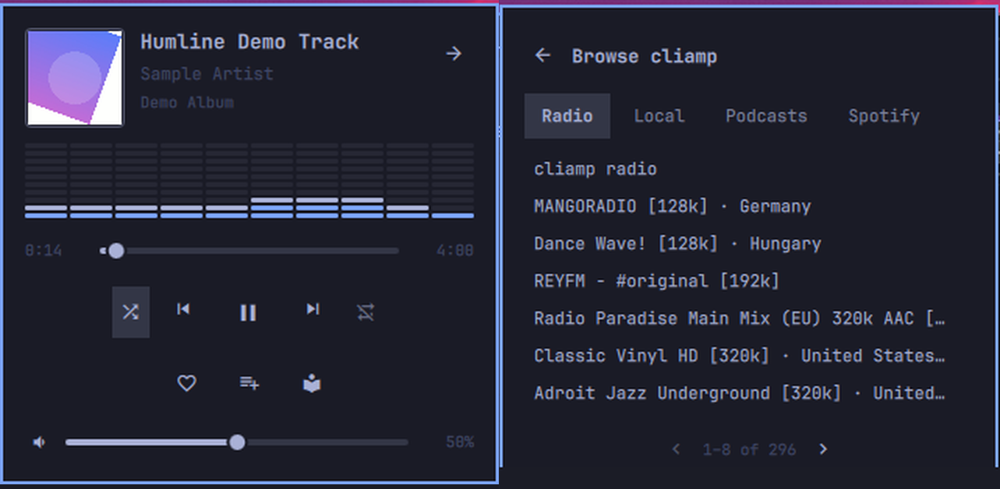
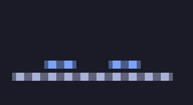

# Humline Player

A tiny now-playing line for the [Omarchy](https://omarchy.org) bar. Ten dots
hum along with whatever is playing; one click opens a themed card. Works with
any MPRIS player, and when that player is
[cliamp](https://github.com/bjarneo/cliamp) it also gets hearts, playlists and
a source browser.



The bar face is just this: 

> **Unofficial, personal project.** I built Humline mainly for my own setup
> (Omarchy + cliamp) and share it as-is. It is not made, endorsed or
> supported by Omarchy, Basecamp, cliamp or any music service.

## Why Humline

- **Small on the bar, small in memory.** A 10-dot spectrum from real PipeWire
  output ([cava](https://github.com/karlstav/cava)) and a pause glyph, no
  labels or buttons taking up space.
- **Pay only for what you open.** Nothing runs while nothing plays, the card
  and the cliamp code load when you open the card and are released when you
  close it (see [Footprint](#footprint)).
- **cliamp-native when it matters.** Like a track, add it to a playlist or
  browse radio/local/podcasts/Spotify without leaving the bar. Any other
  player just gets the clean generic card.
- **Jump to the source.** Right-click focuses the window playing the audio
  (browser web app, terminal, even the right [herdr](https://herdr.dev) tab)
  and leaves your mouse cursor where it was.

## Features

- **Bar:** the dot spectrum while audio plays, a pause glyph when paused.
- **Card:** cover art, title/artist/album, larger spectrum, seek bar,
  previous/play/next, shuffle/repeat (if the player supports them), volume.
- **Several players at once:** each gets its own row with play/pause and
  jump; click a row to make it the main one (it stays main while it plays; when it stops, whichever player is playing takes over).
- **cliamp extras** (only while cliamp is the active player):
  - **Heart:** like/unlike the track in cliamp's Favorites (same as `n` in
    cliamp).
  - **Add to playlist:** your local cliamp playlists (click a checked one to
    remove the track) and, on request, your own Spotify playlists.
  - **Browse:** one tab per cliamp provider (Radio, Local, Podcasts,
    Spotify…); pick a playlist or station to play it.

## Compatibility

Tested on Omarchy 4.0 (the Quickshell-based `omarchy-shell`, not the older
Waybar setup), Hyprland 0.56 and cliamp 2.0.1 and 2.2.0.

| Needs | For |
| --- | --- |
| `cava` | the spectrum (without it you get a static icon) |
| `jq`, `busctl` (systemd), `hyprctl` | jump to player |
| `python3` | the cliamp extras |
| `herdr` (optional) | jumping to a herdr tab |

## Install

```bash
omarchy pkg add cava jq
omarchy plugin add https://github.com/resn3t/humline.git --enable
```

It lands in the center of the bar; move it with
`omarchy bar move humline --section right`. Optional keybinding
(`~/.config/hypr/bindings.lua`):

```lua
o.bind("SUPER + M", "Now playing", "omarchy-shell -q humline togglePopup")
```

**Update:** `omarchy plugin update humline` · **Remove:** `omarchy plugin remove humline`

## Usage

| Action | Result |
| --- | --- |
| Left-click | open/close the card (click outside or press Esc to dismiss) |
| Right-click | jump to the player |
| Middle-click | play/pause |
| Scroll | previous/next track |
| Seek bar | drag, or scroll for ±10 s |
| Volume slider | drag, or scroll for ±5 % |

### Keyboard (card open)

| Key | Action |
| --- | --- |
| `Space` / `Enter` | play/pause |
| `←` `→` (or `h` `l`) | previous / next track |
| `↑` `↓` (or `k` `j`) | volume ±5 % |
| `,` `.` | seek −10 s / +10 s |
| `Tab` / `Shift+Tab` | switch between players |
| `s` / `r` | shuffle / repeat |
| `g` | go to the player |
| `f` `a` `b` | cliamp only: favorite, add to playlist, browse |
| `Esc` | back from the browser, or close the card |

In the cliamp browser and playlist picker, `←` `→` page through the list.

### Settings

The widget settings in Omarchy's bar configuration offer **Hide when
paused** (remove Humline from the bar while nothing plays) and **Spectrum dots**
(4 to 10 columns on the bar face; the card always shows ten). No card content
depends on them.

IPC for scripts and keybindings:

```bash
omarchy-shell humline togglePopup
omarchy-shell humline focusPlayer
omarchy-shell humline seek 10        # or: seek -10
omarchy-shell humline volume 0.05    # or: volume -0.05
# cliamp only:
omarchy-shell humline toggleFavorite
omarchy-shell humline browse
omarchy-shell humline browseSource radio   # or local, podcast, spotify…
omarchy-shell humline addToPlaylist
```

## Footprint

Measured on my machine (Omarchy 4.0, Hyprland 0.56, cliamp playing the same
radio stream, 20 s samples, card closed). These are my numbers, one run each,
not a benchmark. `tools/footprint.sh "<label>" [seconds]` reads `/proc` and
changes nothing, so you can repeat it.

| Bar setup | Shell RSS | CPU (shell + children) | Extra processes |
| --- | --- | --- | --- |
| No media widget | 341 MB | 0.8 % | none |
| Built-in `omarchy.media` | 342 MB | 0.9 % | none |
| Humline 1.3, **playing** | 350 MB | 8.5 % | one `cava` |
| Humline, **paused** (1.2.0) | 347 MB | 0.9 % | none |

So while paused Humline costs nothing measurable, the same as the built-in
widget. While playing, the live spectrum is not free: about 5-8 % of one core
here (`cava` plus the shell redrawing ten dot columns). If that matters, set
**Spectrum dots** lower or use **Hide when paused**; a widget without a
spectrum is lighter. I did not measure other third-party widgets.

Other facts:

- The card adds about 8-10 MB of shell memory while open and gives it back on
  close (ten open/close cycles: 361 MB before, 357 MB after).
- With two monitors, 1.1.1 ran two `cava` processes; 1.3 runs one, shared by
  every bar (tested with a second virtual monitor).
- Each click on a cliamp action runs one short-lived helper process.

## Known limits

- **cliamp's heart marker:** cliamp has no remote command for favorites, so
  Humline writes `favorites.toml` itself, in cliamp's format and under its
  lock. cliamp's Favorites list picks it up right away, but the ♥ next to a
  track in a running cliamp only updates after cliamp restarts.
- **Spotify in cliamp:** the first Spotify list after starting cliamp can
  take 10–20 s, and cliamp doesn't respond meanwhile. That's why Spotify
  playlists only load when you ask for them. Spotify playlists are
  add-only, and adding twice adds the track twice.
- Shuffle/repeat changes are saved to cliamp's `config.toml`; that's
  cliamp's own behaviour.
- At cliamp's minimum volume (-30 dB), cliamp reports full volume over MPRIS,
  so the slider shows 100 % until you move it.
- Changes made in cliamp's own UI while the card is open show up on the next
  track change.
- Jumping to a browser picks the window by track title, then by the site of
  the track URL. If several browser windows are open and none matches,
  Humline does not jump (it never guesses). Web apps (their own window) work
  best; in a normal browser it may not select the playing tab.
- The spectrum comes from the whole PipeWire output (`cava`), not from one
  player: if another app makes sound while the active player plays, its audio
  moves the dots too. Per-player capture would need extra processes, which
  Humline avoids.

## Notes

- Like every Omarchy plugin, Humline runs unsandboxed inside your shell.
  Read the code before installing; it's short.
- Privacy: the only network request Humline makes itself is a Spotify oEmbed
  lookup for a cover when a player reports a `spotify:track:` without one.

## Legal

Free to use, modify and share under the [MIT License](LICENSE). The card
layout is adapted from Omarchy's built-in media widget (MIT, © David
Heinemeier Hansson). All product names and trademarks (Omarchy, cliamp,
Spotify, herdr, cava and others) belong to their respective owners. They are
named here only to describe compatibility. Provided "as is", without
warranty.
